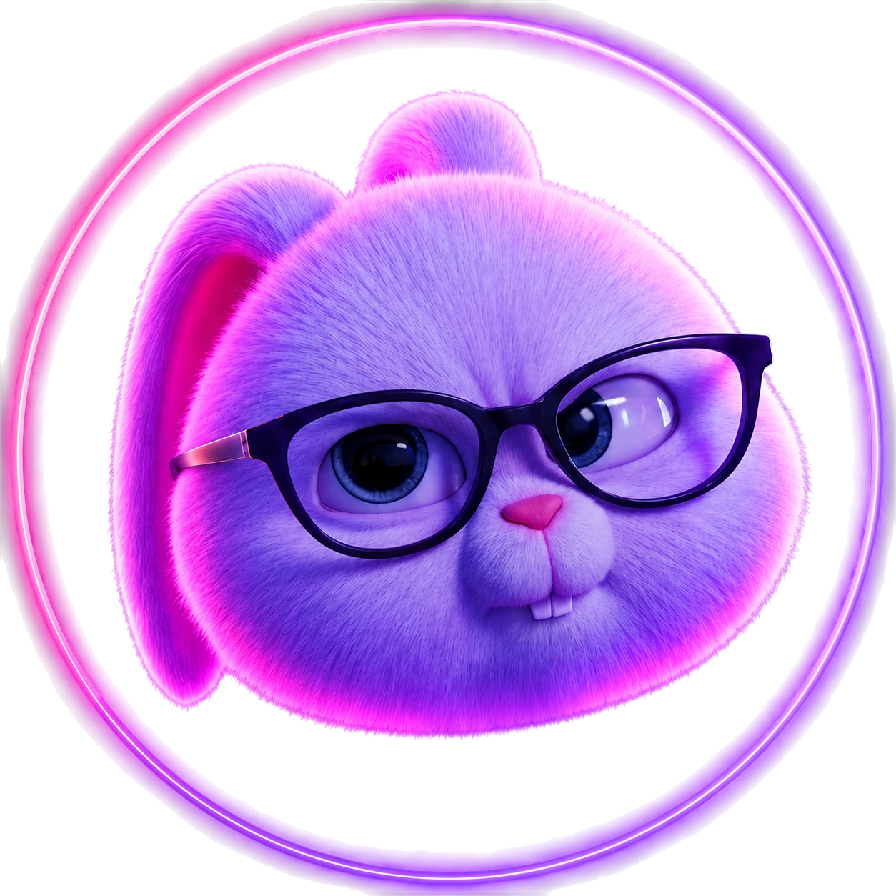

# LINA'S LAB
<em>A little lab for big ideas.</em>

 

> **Researcher** &nbsp;`Lina YAHOUNI`
>  
> **Field** &nbsp;`Biochemistry`
>  
> **Status** &nbsp;`ACTIVE` ●
>  
> **Lab Assistant** &nbsp;`Bunny` 🐰
>  
> **Lab ID** &nbsp;`LY-001`

 

 

#### `01 /` Researcher Profile

I'm Lina YAHOUNI, a Biochemistry student with a curiosity for science, technology, and creative problem-solving. This is my little digital lab — a place where I experiment, learn, build, and turn ideas into something tangible.

 

#### `02 /` Areas of Exploration

- 🧪 **Biochemistry**
- 💻 **Technology & Code**
- 🔬 **Scientific Exploration**
- 🪄 **Creative Problem-Solving**

 

#### `03 /` Lab Equipment

Current toolkit
 
`HTML` `CSS` `JavaScript` `Three.js` `Git` `GitHub`

Currently exploring
 
`Python` `Backend Development` `MySQL`

 

#### `04 /` Lab Activity

 

#### `05 /` Lab Notebook

> *The notebook is open.*
>  
> *New experiments, projects, and ideas will be documented here as they take shape.*

 

#### `06 /` Communication

- [GitHub](https://github.com/Linayahouni)
- [LinkedIn](https://www.linkedin.com/in/lina-djamila-yahouni-4290bb311/)
- [Instagram](https://www.instagram.com/bunnyy.os/)
- [Email](mailto:bunnyosgames@gmail.com)

 
 

`LY-001` ●

<!--
  07 / FROM THE LAB
  Reserved for future YouTube / video content. Keep hidden until populated.
  When ready, continue the existing system: a `07 /` chip + Title Case
  title, matching the sections above — no new visual language needed.
-->

<!--
  08 / EXPERIMENTS
  Reserved for future projects (scientific, games, creative, technology).
  Keep hidden until real projects exist. Individual project entries can
  reuse the "plain label, stamped chip" pattern from Lab Equipment —
  e.g. a project name in plain text with its type (`Scientific`, `Game`,
  `Creative`, `Technology`) as a trailing chip — so new project types
  slot in without inventing a new system.
-->
